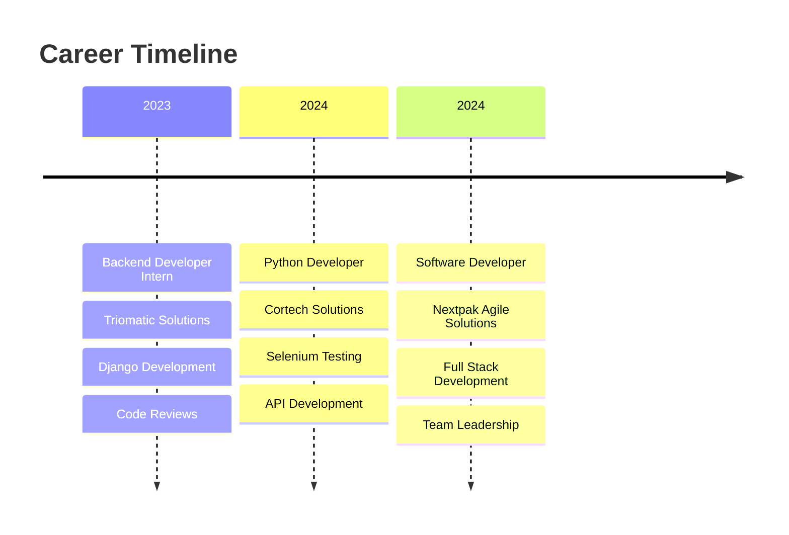

# 🚀 Ukasha Hassan

<div align="center">
  
</div>

<div align="center">
  
</div>

---

## 🎯 About Me

```python
class SoftwareDeveloper:
    def __init__(self):
        self.name = "Ukasha Hassan"
        self.role = "Software Developer"
        self.education = "BS Computer Science @ Air University"
        self.location = "Rawalpindi, Pakistan"
        self.languages = ["Python", "JavaScript", "TypeScript"]
        self.current_focus = ["Full Stack Development", "AI/ML", "Cloud Computing"]
        
    def get_daily_routine(self):
        return {
            "code": "10+ hours",
            "learn": "Always",
            "coffee": "☕ Unlimited",
            "debug": "🐛 Like a detective"
        }
    
    def life_philosophy(self):
        return "Code is poetry written in logic"

me = SoftwareDeveloper()
```

---

## 🛠️ Tech Arsenal

<div align="center">

### 🔥 Languages & Frameworks


### 🗄️ Databases & Cloud


### 🔧 Tools & Technologies


</div>

---

## 📊 GitHub Analytics

<div align="center">
  
  
</div>

<div align="center">
  
</div>

---

## 🏆 Achievement Gallery

<div align="center">
  
</div>

---

## 🚀 Featured Projects

<div align="center">

<a href="https://github.com/ukasha-hassan/ecommerce-platform">
  
</a>

<a href="https://github.com/ukasha-hassan/realtime-quiz-app">
  
</a>

<a href="https://github.com/ukasha-hassan/ai-chatbot">
  
</a>

<a href="https://github.com/ukasha-hassan/email-detection-model">
  
</a>

</div>

---

## 💼 Professional Journey

<div align="center">



</div>

---

## 🎓 Certifications & Achievements

<div align="center">
  <table>
    <tr>
      <td align="center">
        
      </td>
      <td align="center">
        
      </td>
    </tr>
    <tr>
      <td align="center">
        
      </td>
      <td align="center">
        
      </td>
    </tr>
  </table>
</div>

---

## 📈 Contribution Graph

<div align="center">
  
</div>

---

## 🔥 Current Focus

<div align="center">
  
</div>

---

## 🌐 Connect With Me

<div align="center">
  <a href="https://linkedin.com/in/ukasha-hassan-b68133272">
    
  </a>
  <a href="mailto:ukasha.hassan.dev@gmail.com">
    
  </a>
  <a href="https://github.com/ukasha-hassan">
    
  </a>
</div>

---

<div align="center">
  
</div>

<div align="center">
  
</div>
